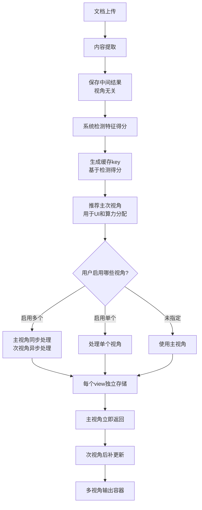

# 技术方案设计：基于视角的文档分类系统（解决4个真实难点）

## 一、总体架构

### 1.1 核心概念（重构后的命名）

- **视角（View）**：系统内部的处理视角，对系统可见，不是对用户
  - **学习视角（Learning View）**：原技术文档结构，用于学习路径、前置条件等
  - **问答视角（Q&A View）**：原面试题结构，用于问题生成、答案提取等
  - **系统视角（System View）**：原架构文档结构，用于组件识别、架构视图等
- **多视角输出容器（Multi-View Output Container）**：包含多个视角结果的容器结构
- **主视角（Primary View）**：系统推荐的主要处理视角（用于UI初始状态和算力分配）
- **次视角（Secondary View）**：系统推荐的备选处理视角（可以异步、后补）
- **启用视角（Enabled Views）**：检测到哪些特征，就生成哪些view（不是每个文档都有所有view）
- **类型（Type）**：内部处理标识，保留用于向后兼容和内部逻辑
  - 主类型 → 默认 view
  - 次特征 → 可选 view
- **中间结果（Intermediate Results）**：视角无关的中间数据（内容提取、段落切分、预处理等）

### 1.2 核心设计原则（重构后）

1. **视角重命名（核心一步）**：
   - 技术文档结构 → 学习视角（Learning View）
   - 面试题结构 → 问答视角（Q&A View）
   - 架构文档结构 → 系统视角（System View）
   - **关键**：这是对系统的命名，不是对用户

2. **多视角输出容器**：
   - 文档处理结果改成"多视角输出容器"
   - 不用统一字段，只要包一层
   - 不是每个文档都有所有view，是"检测到哪些，就生成哪些"

3. **保留并优化分类机制**：
   - 主类型 → 默认 view
   - 次特征 → 可选 view
   - 例如：判断为技术文档 → 默认 learning view → 如果组件关键词多，再加 system view

4. **底层结构多样**：各视角的处理结果结构保持不同，不强制统一

5. **解耦绑定关系**：视角和处理器的绑定关系可配置，避免硬编码

### 1.3 真实难点与解决方案

#### 难点1：多视角独立性
**问题**：不再假设"一次处理只有一个真结果"，一个view的生成/更新，不能影响其他view的稳定性。

**解决方案**：
- 每个view独立存储（UniqueConstraint on document_id + view）
- 独立处理任务，失败不影响其他view
- 增量更新机制，只更新指定view

#### 难点2：特征强弱作为决策依据
**问题**：把"文档特征强弱"变成UI和算力分配的决策依据，主视角 ≠ 用户最终视角，系统推荐不应该参与缓存key，系统检测才是算力与存储的边界。

**解决方案**：
- 缓存key基于系统检测的特征得分，不基于推荐结果
- 主视角用于UI初始状态和算力分配，不影响存储
- 用户可以选择任意视角，不受主视角限制

#### 难点3：中间结果视角无关
**问题**：切换视角 ≠ 重新理解世界，切换视角 = 对同一理解的再组织，中间结果必须是视角无关的。

**解决方案**：
- 中间结果不包含任何视角相关信息
- 所有视角共享同一份中间结果
- 切换视角时复用中间结果，仅重新组织AI处理

#### 难点4：主次视角优先级
**问题**：LLM 并行 ≠ 用户价值并行，Primary View：必须快、稳定、可预测，Secondary View：可以慢、可以异步、可以后补。UI层是：主视角先出结果，次视角显示「正在生成…」。

**解决方案**：
- Primary View：同步处理，优先保证，快速返回
- Secondary View：异步处理，可以后补，不影响主视角
- UI层：主视角先显示结果，次视角显示"正在生成..."状态

### 1.4 架构图



## 二、数据库设计

### 2.1 新增中间结果表（视角无关）

创建 `document_intermediate_results` 表存储视角无关的中间结果：

```sql
CREATE TABLE document_intermediate_results (
    id UUID PRIMARY KEY DEFAULT gen_random_uuid(),
    document_id UUID NOT NULL REFERENCES documents(id) ON DELETE CASCADE,
    content TEXT NOT NULL COMMENT '提取的原始内容（视角无关）',
    preprocessed_content TEXT COMMENT '预处理后的内容（视角无关）',
    segments JSONB COMMENT '段落切分结果（视角无关）',
    metadata JSONB COMMENT '元数据（视角无关）',
    created_at TIMESTAMP WITH TIME ZONE NOT NULL DEFAULT NOW(),
    updated_at TIMESTAMP WITH TIME ZONE NOT NULL DEFAULT NOW(),
    UNIQUE(document_id)
);

CREATE INDEX idx_intermediate_results_document_id ON document_intermediate_results(document_id);
```

### 2.2 修改 processing_results 表（每个view独立存储）

**难点1解决方案**：每个view独立存储，互不影响。

```sql
-- 修改表结构：支持每个view独立存储
ALTER TABLE processing_results 
DROP CONSTRAINT IF EXISTS uq_processing_results_document_id;

ALTER TABLE processing_results 
ADD COLUMN view VARCHAR(50) NULL COMMENT '视角名称（learning/qa/system）',
ADD COLUMN is_primary BOOLEAN DEFAULT FALSE COMMENT '是否为主视角';

-- 创建新的唯一约束：一个文档的同一个view只能有一条记录
ALTER TABLE processing_results 
ADD CONSTRAINT uq_processing_result_document_view 
UNIQUE (document_id, view);

-- 为历史数据填充默认view
UPDATE processing_results 
SET view = CASE 
    WHEN document_type = 'interview' THEN 'qa'
    WHEN document_type = 'architecture' THEN 'system'
    WHEN document_type = 'technical' THEN 'learning'
    ELSE 'learning'
END,
is_primary = TRUE
WHERE view IS NULL;

-- 添加索引
CREATE INDEX idx_processing_results_view ON processing_results(view);
CREATE INDEX idx_processing_results_is_primary ON processing_results(is_primary);
```

### 2.3 修改 document_types 表

```sql
ALTER TABLE document_types 
ADD COLUMN primary_view VARCHAR(50) NULL COMMENT '主视角（用于UI和算力分配）',
ADD COLUMN enabled_views JSONB NULL COMMENT '启用的视角列表',
ADD COLUMN detection_scores JSONB NULL COMMENT '系统检测的特征得分（用于缓存key）';

-- 添加索引
CREATE INDEX idx_document_types_primary_view ON document_types(primary_view);

-- 为历史数据填充默认视角
UPDATE document_types 
SET primary_view = CASE 
    WHEN detected_type = 'interview' THEN 'qa'
    WHEN detected_type = 'architecture' THEN 'system'
    WHEN detected_type = 'technical' THEN 'learning'
    ELSE 'learning'
END,
enabled_views = jsonb_build_array(
    CASE 
        WHEN detected_type = 'interview' THEN 'qa'
        WHEN detected_type = 'architecture' THEN 'system'
        WHEN detected_type = 'technical' THEN 'learning'
        ELSE 'learning'
    END
),
detection_scores = jsonb_build_object(
    CASE 
        WHEN detected_type = 'interview' THEN 'qa'
        WHEN detected_type = 'architecture' THEN 'system'
        WHEN detected_type = 'technical' THEN 'learning'
        ELSE 'learning'
    END, 
    1.0
)
WHERE primary_view IS NULL;
```

### 2.4 数据模型更新

#### DocumentIntermediateResult 模型（视角无关）

```python
class DocumentIntermediateResult(Base):
    """
    文档中间结果表（视角无关）
    
    难点3解决方案：
    - 中间结果不包含任何视角相关的信息
    - 所有视角共享同一份中间结果
    - 切换视角时复用中间结果，仅重新组织AI处理
    """
    __tablename__ = "document_intermediate_results"
    
    id = Column(UUID(as_uuid=True), primary_key=True, default=uuid.uuid4)
    document_id = Column(UUID(as_uuid=True), ForeignKey("documents.id", ondelete="CASCADE"), nullable=False, unique=True)
    
    # 视角无关的中间结果
    content = Column(Text, nullable=False, comment="提取的原始内容（视角无关）")
    preprocessed_content = Column(Text, nullable=True, comment="预处理后的内容（视角无关）")
    segments = Column(JSONB, nullable=True, comment="段落切分结果（视角无关）")
    metadata = Column(JSONB, nullable=True, comment="元数据（视角无关）")
    
    # 注意：不包含任何视角相关的处理结果
    # 视角相关的处理结果存储在 processing_results 表中
    
    created_at = Column(DateTime(timezone=True), nullable=False, server_default=func.now())
    updated_at = Column(DateTime(timezone=True), nullable=False, server_default=func.now(), onupdate=func.now())
```

#### ProcessingResult 模型（每个view独立存储）

```python
class ProcessingResult(Base):
    """
    处理结果表（每个view独立存储）
    
    难点1解决方案：
    - 每个view独立存储，互不影响
    - 一个view的生成/更新，不影响其他view的稳定性
    - 支持view的增量更新
    """
    __tablename__ = "processing_results"
    
    id = Column(UUID(as_uuid=True), primary_key=True)
    document_id = Column(UUID(as_uuid=True), ForeignKey("documents.id", ondelete="CASCADE"), nullable=False)
    view = Column(String(50), nullable=False, comment="视角名称（learning/qa/system）")
    document_type = Column(String(50), nullable=False)  # 保留：内部类型（向后兼容）
    result_data = Column(JSONB, nullable=False, comment="该view的结果（保持原生结构）")
    is_primary = Column(Boolean, default=False, comment="是否为主视角")
    processing_time = Column(Integer, nullable=True)
    created_at = Column(DateTime(timezone=True), nullable=False)
    updated_at = Column(DateTime(timezone=True), nullable=False)
    
    # 唯一约束：一个文档的同一个view只能有一条记录（难点1：独立存储）
    __table_args__ = (
        UniqueConstraint('document_id', 'view', name='uq_processing_result_document_view'),
    )
```

#### DocumentType 模型（更新）

```python
class DocumentType(Base):
    __tablename__ = "document_types"
    
    id = Column(UUID(as_uuid=True), primary_key=True)
    document_id = Column(UUID(as_uuid=True), ForeignKey("documents.id", ondelete="CASCADE"))
    detected_type = Column(String(50), nullable=False)  # 保留：内部类型
    primary_view = Column(String(50), nullable=True)  # 新增：主视角（用于UI和算力分配）
    enabled_views = Column(JSONB, nullable=True)  # 新增：启用的视角列表
    detection_scores = Column(JSONB, nullable=True)  # 新增：系统检测的特征得分（用于缓存key）
    confidence = Column(Float, nullable=True)
    detection_method = Column(String(50), nullable=False)
    detected_at = Column(DateTime(timezone=True), nullable=False, server_default=func.now())
```

## 三、视角识别器设计（主次视角+缓存key）

### 3.1 新的识别逻辑

```python
class DocumentViewClassifier:
    """文档视角分类器（重构后的命名）"""
    
    @staticmethod
    def detect_qa_structure(content: str) -> float:
        """检测 Q&A 结构特征"""
        # 实现逻辑...
        pass
    
    @staticmethod
    def detect_component_relationships(content: str) -> float:
        """检测系统组件关系特征"""
        # 实现逻辑...
        pass
    
    @staticmethod
    def detect_usage_flow(content: str) -> float:
        """检测使用流程特征"""
        # 实现逻辑...
        pass
    
    @staticmethod
    async def recommend_views(
        content: str,
        api_key: Optional[str] = None,
        api_base: Optional[str] = None
    ) -> Dict[str, Any]:
        """
        推荐处理视角（难点2解决方案）
        
        关键点：
        - 系统检测的特征得分用于UI和算力分配决策
        - 主视角用于UI初始状态和算力分配，但不影响存储
        - 缓存key基于系统检测的特征得分，不基于推荐结果
        - 系统检测才是算力与存储的边界
        """
        # 1. 系统检测特征得分（这是算力与存储的边界）
        detection_scores = {
            'qa': DocumentViewClassifier.detect_qa_structure(content),
            'system': DocumentViewClassifier.detect_component_relationships(content),
            'learning': DocumentViewClassifier.detect_usage_flow(content)
        }
        
        # 2. 生成缓存key（基于检测得分，不基于推荐）- 难点2解决方案
        cache_key = generate_cache_key_from_scores(document_id, detection_scores)
        
        # 3. 确定主类型（向后兼容）
        type_scores = {
            'technical': detection_scores['learning'],
            'interview': detection_scores['qa'],
            'architecture': detection_scores['system']
        }
        primary_type = max(type_scores, key=type_scores.get)
        
        # 4. 主类型 → 默认 view（用于UI和算力分配）
        type_to_view = {
            'technical': 'learning',
            'interview': 'qa',
            'architecture': 'system'
        }
        primary_view = type_to_view[primary_type]
        
        # 5. 次特征 → 可选 view（检测到哪些就生成哪些）
        enabled_views = [primary_view]
        view_threshold = 0.3
        for view, score in detection_scores.items():
            if view != primary_view and score >= view_threshold:
                enabled_views.append(view)
        
        # 6. 如果主视角置信度低，使用AI
        if detection_scores[primary_view] < 0.5 and api_key:
            ai_result = await DocumentViewClassifier.ai_recommend_views(
                content, api_key, api_base
            )
            if ai_result:
                return ai_result
        
        # 7. 返回推荐结果
        return {
            'primary_view': primary_view,  # 用于UI初始状态和算力分配
            'enabled_views': enabled_views,  # 用于算力分配
            'detection_scores': detection_scores,  # 系统检测的原始得分（用于缓存key）
            'cache_key': cache_key,  # 基于检测得分，不基于推荐
            'method': 'rule',
            'type_mapping': primary_type,  # 向后兼容
            'secondary_types': [
                t for t, s in type_scores.items() 
                if t != primary_type and s >= view_threshold
            ]
        }

def generate_cache_key_from_scores(
    document_id: str,
    detection_scores: Dict[str, float]
) -> str:
    """
    生成缓存key（基于系统检测的特征得分，不基于推荐结果）
    
    难点2解决方案：
    - 缓存key基于系统检测的原始得分
    - 不包含推荐结果（主视角、次视角等）
    - 系统检测才是算力与存储的边界
    """
    import hashlib
    import json
    
    # 基于检测得分生成key（不包含推荐逻辑）
    score_str = json.dumps(detection_scores, sort_keys=True)
    score_hash = hashlib.md5(score_str.encode()).hexdigest()
    
    return f"doc:{document_id}:detection:{score_hash}"
```

### 3.2 视角配置注册表（解耦绑定关系）

```python
class ViewRegistry:
    """视角注册表 - 解耦视角和处理器的绑定关系"""
    
    _registry: Dict[str, Dict] = {}
    
    VIEW_NAMES = {
        'learning': '学习视角',
        'qa': '问答视角',
        'system': '系统视角'
    }
    
    @classmethod
    def register(
        cls,
        view: str,
        processor_class: Type,
        type_mapping: str,
        result_adapter: Optional[Callable] = None
    ):
        """注册视角配置"""
        cls._registry[view] = {
            'processor_class': processor_class,
            'type_mapping': type_mapping,
            'result_adapter': result_adapter,
            'display_name': cls.VIEW_NAMES.get(view, view)
        }
    
    @classmethod
    def get_processor(cls, view: str):
        """获取处理器实例"""
        if view not in cls._registry:
            raise ValueError(f"未注册的视角: {view}")
        return cls._registry[view]['processor_class']
    
    @classmethod
    def list_views(cls) -> List[str]:
        """列出所有已注册的视角"""
        return list(cls._registry.keys())

# 初始化注册表
ViewRegistry.register('learning', TechnicalProcessor, 'technical')
ViewRegistry.register('qa', InterviewProcessor, 'interview')
ViewRegistry.register('system', ArchitectureProcessor, 'architecture')
```

### 3.3 多视角输出容器

```python
class MultiViewOutputContainer:
    """多视角输出容器 - 包装多个视角的结果"""
    
    @staticmethod
    def create_container(
        views: Dict[str, Dict],
        enabled_views: List[str],
        confidence: Optional[Dict[str, float]] = None,
        primary_view: Optional[str] = None
    ) -> Dict:
        """
        创建多视角输出容器
        
        关键点：
        - 不用统一字段，只要包一层
        - 不是每个文档都有所有view，检测到哪些就生成哪些
        """
        return {
            'views': views,  # 各视角的结果，保持原生结构
            'meta': {
                'enabled_views': enabled_views,
                'primary_view': primary_view,
                'confidence': confidence or {},
                'view_count': len(views),
                'timestamp': datetime.now().isoformat()
            }
        }
```

## 四、中间结果复用机制（视角无关）

### 4.1 中间结果存储（视角无关）

**难点3解决方案**：中间结果必须是视角无关的。

```python
async def save_intermediate_results(
    document_id: str,
    content: str,
    preprocessed_content: str,
    segments: List[Dict],
    metadata: Dict,
    db: AsyncSession
):
    """
    保存中间结果（视角无关）
    
    关键点：
    - 中间结果不包含任何视角相关的信息
    - 所有视角共享同一份中间结果
    - 切换视角时复用这些中间结果，仅重新组织AI处理
    """
    intermediate_result = DocumentIntermediateResult(
        document_id=document_id,
        content=content,  # 原始内容（视角无关）
        preprocessed_content=preprocessed_content,  # 预处理后内容（视角无关）
        segments=segments,  # 段落切分结果（视角无关）
        metadata=metadata  # 元数据（视角无关）
    )
    db.add(intermediate_result)
    await db.commit()
    
    # 注意：中间结果不包含任何视角相关的处理结果
    # 视角相关的处理结果存储在 processing_results 表中
```

### 4.2 快速切换视角（复用中间结果）

```python
async def switch_view(
    document_id: str,
    target_view: str,
    db: AsyncSession
) -> Dict:
    """
    快速切换视角（对同一理解的再组织）
    
    难点3解决方案：
    - 切换视角 ≠ 重新理解世界
    - 切换视角 = 对同一理解的再组织
    - 复用视角无关的中间结果
    """
    start_time = datetime.now()
    
    # 1. 获取视角无关的中间结果
    intermediate = await get_intermediate_results(document_id, db)
    
    if not intermediate:
        raise HTTPException(
            status_code=status.HTTP_400_BAD_REQUEST,
            detail="中间结果不存在，需要重新处理文档"
        )
    
    # 2. 复用中间结果（视角无关）
    content = intermediate.preprocessed_content or intermediate.content
    segments = intermediate.segments or []
    
    # 3. 仅重新组织AI处理（根据新视角）
    processor_class = ViewRegistry.get_processor(target_view)
    processor = processor_class()
    result_data = await processor.process(
        content=content,  # 复用视角无关的内容
        segments=segments,  # 复用视角无关的段落
        # 其他参数...
    )
    
    # 4. 保存新视角的结果（难点1：独立存储，不影响其他view）
    view_result = ProcessingResult(
        document_id=document_id,
        view=target_view,
        document_type=ViewRegistry.get_type_mapping(target_view),
        result_data=result_data,  # 保持原生结构
        is_primary=False,
        processing_time=int((datetime.now() - start_time).total_seconds())
    )
    db.add(view_result)
    await db.commit()  # 立即提交，确保该view结果稳定
    
    elapsed_time = (datetime.now() - start_time).total_seconds()
    if elapsed_time > 5:
        logger.warning("视角切换耗时超过5秒", 
                      document_id=document_id,
                      elapsed_time=elapsed_time)
    
    return {
        'view': target_view,
        'result': result_data,
        'processing_time': elapsed_time,
        'used_intermediate_results': True
    }
```

## 五、API 设计

### 5.1 上传接口增强

```python
@router.post("/upload", response_model=DocumentUploadResponse)
async def upload_document(
    file: UploadFile = File(...),
    views: Optional[str] = Query(None, description="启用的视角列表，逗号分隔（learning,qa,system）"),
    db: AsyncSession = Depends(get_db)
):
    """
    上传文档（支持启用多个视角）
    
    - views: 可选，用户指定的处理视角列表（逗号分隔）
      - 如果不提供，系统会自动推荐主视角
      - 如果提供，使用用户指定的视角列表
    """
    # 1. 上传文件
    # 2. 提取内容
    # 3. 保存中间结果（视角无关）
    # 4. 系统检测特征得分（用于缓存key）
    # 5. 推荐主次视角（用于UI和算力分配）
    # 6. 触发处理任务（主视角同步，次视角异步）
```

### 5.2 新增视角推荐接口

```python
@router.post("/{document_id}/recommend-views")
async def recommend_views(
    document_id: str,
    db: AsyncSession = Depends(get_db)
):
    """
    推荐文档处理视角（主次视角）
    
    返回：
    - primary_view: 主视角（用于UI初始状态和算力分配）
    - enabled_views: 启用的视角列表
    - detection_scores: 系统检测的特征得分（用于缓存key）
    - cache_key: 基于检测得分生成的缓存key
    """
    # 1. 获取文档内容（或中间结果）
    # 2. 调用视角推荐器
    # 3. 返回推荐结果
```

### 5.3 新增快速切换视角接口

```python
@router.post("/{document_id}/switch-view")
async def switch_view(
    document_id: str,
    view: str = Query(..., description="目标视角"),
    db: AsyncSession = Depends(get_db)
):
    """
    快速切换视角（复用中间结果）
    
    难点3解决方案：
    - 复用视角无关的中间结果
    - 仅重新组织AI处理
    - 5秒内完成
    """
    # 1. 验证view参数
    # 2. 调用快速切换逻辑
    # 3. 返回结果
```

### 5.4 新增视角状态接口

```python
@router.get("/{document_id}/views/status")
async def get_views_status(
    document_id: str,
    db: AsyncSession = Depends(get_db)
):
    """
    获取各视角的处理状态（难点4解决方案）
    
    用于UI层轮询，显示"正在生成..."状态
    """
    # 查询所有view的处理状态
    # 返回主视角和次视角的状态
```

### 5.5 修改处理结果接口

```python
@router.get("/{document_id}/result")
async def get_document_result(
    document_id: str,
    view: Optional[str] = Query(None, description="指定视角（可选）"),
    views: Optional[str] = Query(None, description="指定多个视角（可选，逗号分隔）"),
    db: AsyncSession = Depends(get_db)
):
    """
    获取文档处理结果（多视角输出容器）
    
    关键点：
    - 用户可以选择任意视角，不受主视角限制（难点2）
    - 从容器中提取指定view的结果
    - 保持各view的原生结构
    """
    # 1. 查询多视角输出容器
    # 2. 如果指定了view或views，从容器中提取
    # 3. 返回结果
```

## 六、处理流程改造（主次视角优先级）

### 6.1 文档处理任务改造

```python
@celery_app.task(bind=True, name="app.tasks.document_processing.process_document")
def process_document_task(
    self, 
    document_id: str, 
    task_id: str, 
    views: Optional[List[str]] = None
):
    """
    处理文档任务（支持启用多个视角，主次视角优先级策略）
    
    难点4解决方案：
    - Primary View：同步处理，优先保证，快速返回
    - Secondary View：异步处理，可以后补，不影响主视角
    """
    async def _process():
        # 1. 提取内容（视角无关）
        content = await DocumentExtractor.extract(...)
        
        # 2. 文本预处理（视角无关）
        preprocessed_content = await TextPreprocessor.preprocess(...)
        
        # 3. 段落切分（视角无关）
        segments = await SourceSegmenter.segment(...)
        
        # 4. 保存中间结果（视角无关，难点3）
        await save_intermediate_results(
            document_id=document_id,
            content=content,
            preprocessed_content=preprocessed_content,
            segments=segments,
            metadata={...},
            db=db
        )
        
        # 5. 系统检测特征得分（难点2：用于缓存key）
        detection_scores = {
            'qa': DocumentViewClassifier.detect_qa_structure(preprocessed_content),
            'system': DocumentViewClassifier.detect_component_relationships(preprocessed_content),
            'learning': DocumentViewClassifier.detect_usage_flow(preprocessed_content)
        }
        
        # 6. 生成缓存key（基于检测得分，不基于推荐）
        cache_key = generate_cache_key_from_scores(document_id, detection_scores)
        
        # 7. 推荐主次视角（用于UI和算力分配，不影响存储）
        if views:
            enabled_views = views
            primary_view = views[0] if views else 'learning'
        else:
            recommendation = await DocumentViewClassifier.recommend_views(
                content=preprocessed_content,
                api_key=settings.DEEPSEEK_API_KEY,
                api_base=settings.DEEPSEEK_API_BASE
            )
            primary_view = recommendation['primary_view']
            enabled_views = recommendation['enabled_views']
        
        # 8. 保存推荐信息（用于UI和算力分配）
        doc_type = DocumentType(
            document_id=doc_uuid,
            detected_type=ViewRegistry.get_type_mapping(primary_view),
            primary_view=primary_view,
            enabled_views=enabled_views,
            detection_scores=detection_scores,  # 保存检测得分（用于缓存key）
            confidence=detection_scores.get(primary_view, 0.0),
            detection_method='rule'
        )
        db.add(doc_type)
        await db.commit()
        
        # 9. 处理主视角（同步，优先保证，快速返回）- 难点4
        primary_result = None
        primary_processing_time = None
        
        if primary_view in enabled_views:
            try:
                processor_class = ViewRegistry.get_processor(primary_view)
                processor = processor_class()
                
                start_time = datetime.now()
                primary_result = await processor.process(
                    content=preprocessed_content,
                    segments=segments,
                    # 其他参数...
                )
                primary_processing_time = int((datetime.now() - start_time).total_seconds())
                
                # 立即保存主视角结果（难点1：独立存储）
                primary_view_result = ProcessingResult(
                    document_id=doc_uuid,
                    view=primary_view,
                    document_type=ViewRegistry.get_type_mapping(primary_view),
                    result_data=primary_result,
                    is_primary=True,
                    processing_time=primary_processing_time
                )
                db.add(primary_view_result)
                await db.commit()  # 立即提交，确保主视角结果稳定
                
                logger.info("主视角处理完成", 
                          document_id=document_id,
                          view=primary_view,
                          processing_time=primary_processing_time)
                
            except Exception as e:
                logger.error(f"主视角处理失败: {primary_view}", 
                           document_id=document_id, 
                           error=str(e))
        
        # 10. 异步处理次视角（可以慢、可以后补，不影响主视角）- 难点4
        secondary_views = [v for v in enabled_views if v != primary_view]
        
        async def process_secondary_view(view: str):
            """异步处理次视角"""
            try:
                processor_class = ViewRegistry.get_processor(view)
                processor = processor_class()
                
                start_time = datetime.now()
                result_data = await processor.process(
                    content=preprocessed_content,
                    segments=segments,
                    # 其他参数...
                )
                processing_time = int((datetime.now() - start_time).total_seconds())
                
                # 保存次视角结果（难点1：独立存储，不影响其他view）
                secondary_view_result = ProcessingResult(
                    document_id=doc_uuid,
                    view=view,
                    document_type=ViewRegistry.get_type_mapping(view),
                    result_data=result_data,
                    is_primary=False,
                    processing_time=processing_time
                )
                db.add(secondary_view_result)
                await db.commit()  # 独立提交，不影响其他view
                
                return {
                    'view': view,
                    'result': result_data,
                    'processing_time': processing_time
                }
                
            except Exception as e:
                logger.error(f"次视角处理失败: {view}", 
                           document_id=document_id, 
                           error=str(e))
                return None
        
        # 并行处理次视角（不影响主视角）
        secondary_results = {}
        if secondary_views:
            secondary_tasks = [process_secondary_view(view) for view in secondary_views]
            results = await asyncio.gather(*secondary_tasks, return_exceptions=True)
            
            for result in results:
                if result and not isinstance(result, Exception):
                    secondary_results[result['view']] = result['result']
        
        # 11. 创建多视角输出容器
        all_views = {}
        if primary_result:
            all_views[primary_view] = primary_result
        all_views.update(secondary_results)
        
        container = MultiViewOutputContainer.create_container(
            views=all_views,
            enabled_views=enabled_views,
            confidence=detection_scores,
            primary_view=primary_view
        )
        
        # 12. 返回处理结果（主视角立即返回，次视角后补）
        return {
            'document_id': document_id,
            'container': container,
            'primary_view': primary_view,
            'primary_view_ready': primary_result is not None,
            'secondary_views_ready': list(secondary_results.keys()),
            'processing_times': {
                primary_view: primary_processing_time,
                **{v: r.get('processing_time') for v, r in secondary_results.items()}
            }
        }
```

## 七、前端UI设计（主次视角优先级）

### 7.1 结果页面（主视角先出，次视角后补）

```typescript
// Result.tsx
const Result = () => {
  const { documentId } = useParams()
  const [primaryView, setPrimaryView] = useState<string>('')
  const [viewStatuses, setViewStatuses] = useState<Map<string, ViewStatus>>(new Map())
  
  useEffect(() => {
    // 1. 获取推荐视角
    documentsApi.recommendViews(documentId).then(recommendation => {
      setPrimaryView(recommendation.primary_view)
      
      // 2. 立即获取主视角结果（优先显示）
      documentsApi.getResult(documentId, recommendation.primary_view)
        .then(result => {
          setViewStatuses(prev => {
            const next = new Map(prev)
            next.set(recommendation.primary_view, {
              view: recommendation.primary_view,
              status: 'completed',
              result: result.result,
              ready: true
            })
            return next
          })
        })
      
      // 3. 轮询次视角状态（显示"正在生成..."）
      const interval = setInterval(() => {
        documentsApi.getViewsStatus(documentId).then(statuses => {
          setViewStatuses(prev => {
            const next = new Map(prev)
            statuses.views_status.forEach((status: ViewStatus) => {
              if (status.view !== recommendation.primary_view) {
                next.set(status.view, status)
              }
            })
            return next
          })
        })
      }, 2000)  // 每2秒轮询一次
      
      return () => clearInterval(interval)
    })
  }, [documentId])
  
  return (
    <div>
      {/* 主视角：立即显示结果 */}
      {primaryView && viewStatuses.get(primaryView)?.ready && (
        <ViewResult 
          view={primaryView} 
          result={viewStatuses.get(primaryView)?.result} 
        />
      )}
      
      {/* 次视角：显示"正在生成..."或结果 */}
      {secondaryViews.map(view => {
        const status = viewStatuses.get(view)
        if (!status || status.status === 'processing' || status.status === 'pending') {
          return (
            <div key={view}>
              <ViewPlaceholder view={view} message="正在生成..." />
            </div>
          )
        } else if (status.status === 'completed' && status.ready) {
          return (
            <ViewResult key={view} view={view} result={status.result} />
          )
        }
        return null
      })}
    </div>
  )
}
```

## 八、缓存策略（基于系统检测）

### 8.1 缓存key生成

```python
def generate_cache_key_from_scores(
    document_id: str,
    detection_scores: Dict[str, float]
) -> str:
    """
    生成缓存key（基于系统检测的特征得分，不基于推荐结果）
    
    难点2解决方案：
    - 缓存key基于系统检测的原始得分
    - 不包含推荐结果（主视角、次视角等）
    - 系统检测才是算力与存储的边界
    """
    import hashlib
    import json
    
    # 基于检测得分生成key（不包含推荐逻辑）
    score_str = json.dumps(detection_scores, sort_keys=True)
    score_hash = hashlib.md5(score_str.encode()).hexdigest()
    
    return f"doc:{document_id}:detection:{score_hash}"

# 使用示例
detection_scores = {
    'learning': 0.85,
    'system': 0.65,
    'qa': 0.15
}
cache_key = generate_cache_key_from_scores(document_id, detection_scores)
# 结果：doc:xxx:detection:abc123...
# 注意：不包含primary_view、enabled_views等推荐结果
```

## 九、向后兼容性方案

### 9.1 类型到视角的映射

```python
TYPE_TO_VIEW_MAP = {
    'technical': 'learning',
    'interview': 'qa',
    'architecture': 'system',
    'unknown': 'learning'
}

def get_view_from_type(document_type: str) -> str:
    """从类型推断视角（向后兼容）"""
    return TYPE_TO_VIEW_MAP.get(document_type, 'learning')
```

### 9.2 API兼容性处理

```python
def enrich_result_with_views(result: Dict) -> Dict:
    """为结果添加视角信息（向后兼容）"""
    if not result.get('view') and result.get('document_type'):
        result['view'] = get_view_from_type(result['document_type'])
        result['primary_view'] = result['view']
        result['enabled_views'] = [result['view']]
    return result
```

## 十、数据库迁移脚本

```python
# alembic/versions/004_add_views_and_intermediate_results.py
def upgrade():
    # 1. 创建中间结果表（视角无关）
    op.create_table(
        'document_intermediate_results',
        sa.Column('id', sa.UUID(), nullable=False),
        sa.Column('document_id', sa.UUID(), nullable=False),
        sa.Column('content', sa.Text(), nullable=False),
        sa.Column('preprocessed_content', sa.Text(), nullable=True),
        sa.Column('segments', sa.JSON(), nullable=True),
        sa.Column('metadata', sa.JSON(), nullable=True),
        sa.Column('created_at', sa.DateTime(timezone=True), nullable=False),
        sa.Column('updated_at', sa.DateTime(timezone=True), nullable=False),
        sa.ForeignKeyConstraint(['document_id'], ['documents.id'], ondelete='CASCADE'),
        sa.PrimaryKeyConstraint('id'),
        sa.UniqueConstraint('document_id')
    )
    
    # 2. 修改processing_results表（每个view独立存储）
    op.drop_constraint('uq_processing_results_document_id', 'processing_results', type_='unique')
    op.add_column('processing_results', sa.Column('view', sa.String(50), nullable=True))
    op.add_column('processing_results', sa.Column('is_primary', sa.Boolean(), default=False))
    op.create_unique_constraint('uq_processing_result_document_view', 'processing_results', ['document_id', 'view'])
    
    # 3. 修改document_types表
    op.add_column('document_types', sa.Column('primary_view', sa.String(50), nullable=True))
    op.add_column('document_types', sa.Column('enabled_views', sa.JSON(), nullable=True))
    op.add_column('document_types', sa.Column('detection_scores', sa.JSON(), nullable=True))
    
    # 4. 为历史数据填充默认值
    op.execute("""
        UPDATE processing_results 
        SET view = CASE 
            WHEN document_type = 'interview' THEN 'qa'
            WHEN document_type = 'architecture' THEN 'system'
            WHEN document_type = 'technical' THEN 'learning'
            ELSE 'learning'
        END,
        is_primary = TRUE
        WHERE view IS NULL
    """)
    
    op.execute("""
        UPDATE document_types 
        SET primary_view = CASE 
            WHEN detected_type = 'interview' THEN 'qa'
            WHEN detected_type = 'architecture' THEN 'system'
            WHEN detected_type = 'technical' THEN 'learning'
            ELSE 'learning'
        END,
        enabled_views = jsonb_build_array(
            CASE 
                WHEN detected_type = 'interview' THEN 'qa'
                WHEN detected_type = 'architecture' THEN 'system'
                WHEN detected_type = 'technical' THEN 'learning'
                ELSE 'learning'
            END
        ),
        detection_scores = jsonb_build_object(
            CASE 
                WHEN detected_type = 'interview' THEN 'qa'
                WHEN detected_type = 'architecture' THEN 'system'
                WHEN detected_type = 'technical' THEN 'learning'
                ELSE 'learning'
            END, 
            1.0
        )
        WHERE primary_view IS NULL
    """)
    
    # 5. 创建索引
    op.create_index('idx_intermediate_results_document_id', 
                   'document_intermediate_results', ['document_id'])
    op.create_index('idx_processing_results_view', 
                   'processing_results', ['view'])
    op.create_index('idx_processing_results_is_primary', 
                   'processing_results', ['is_primary'])
    op.create_index('idx_document_types_primary_view', 
                   'document_types', ['primary_view'])
```

---

**文档版本**：v3.0  
**创建时间**：2025-12-21  
**最后更新**：2025-12-21  
**核心价值**：解决4个真实难点，确保架构设计的正确性和可实施性
